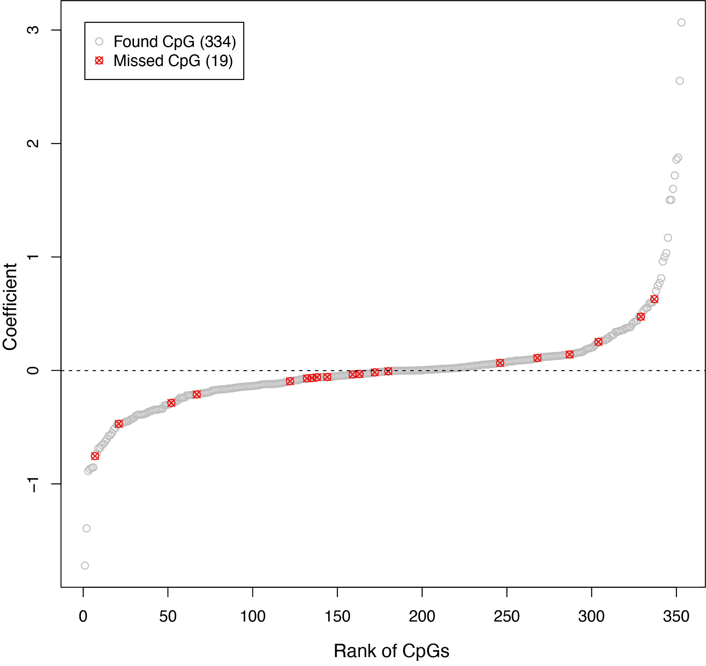
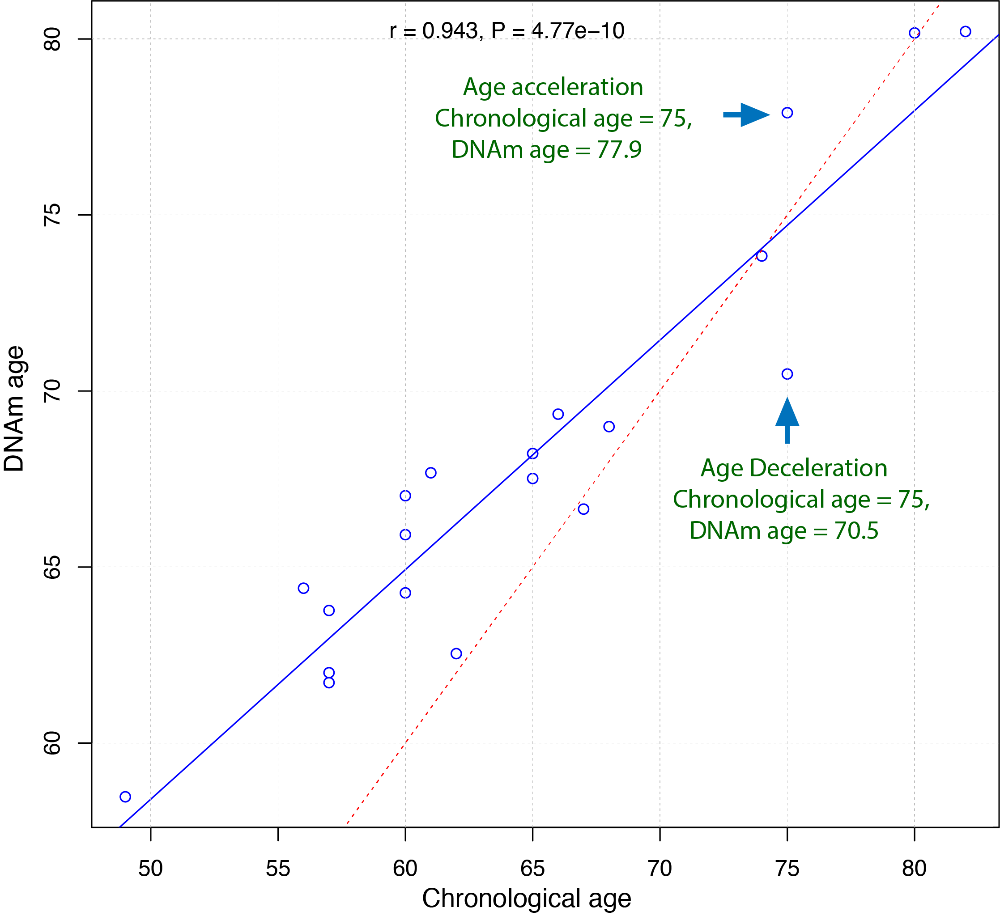

Horvath13
=========

The :code:`Horvath13` command calculates the DNA methylation clock developed by Steve Horvath, as published in 2013 [1]_. 

.. csv-table::
   :widths: 25, 55

   "Predictor CpGs", "353"
   "Unit", "Year"
   "Target Tissue", "Pan-tissue or multiple tissue"
   "Target Population", "Adult"
   "Method", "Elastic Net regression."
   "Reference", "`Horvath, S. Genome biology (2013). <https://pubmed.ncbi.nlm.nih.gov/24138928/>`_"

Usage
-----
.. code-block:: text
 
  usage: epical Horvath13 [-h] [-o out_prefix] [-p PERCENT] [-d DELIMITER]
                          [-f {pdf,png}] [-m meta_file] [-l log_file]
                          [--impute {-1,0,1,2,3,4,5,6,7,8,9,10}] [-r ref_file]
                          [--overwrite] [--debug]
                          Input_file

  positional arguments:
    Input_file            The input tabular structure file containing DNA
                          methylation data. This filemust have a header row,
                          which contains the names or labels for samples
                          Thefirst column of this file should contain CpG IDs.
                          The remaining cells in thefile should contain DNA
                          methylation beta values, represented as floating-
                          pointnumbers between 0 and 1. Use a TAB, comma, or any
                          other delimiter to separatethe columns. Use 'NaN' or
                          'NA' to represent missing values. This file can be a
                          regular text file or compressed file (".gz", ".Z",
                          ".z", ".bz", ".bz2", ".bzip2").
  options:
    -h, --help            show this help message and exit
    -o out_prefix, --output out_prefix
                          The PREFIX of output files. If no PREFIX is provided,
                          the default prefix "clock_name_out" is used. The
                          generated output files include:
                          "<PREFIX>.DNAm_age.tsv": This file contains the
                          predicted DNAm age. "<PREFIX>.used_CpGs.tsv": This
                          file lists the CpGs that were used to calculate the
                          DNAm age. "<PREFIX>.missed_CpGs.txt": This file
                          provides a list of clock CpGs that were missed or
                          excluded from the input file. "<PREFIX>.coef.tsv":
                          This file contains a list of clock CpGs along with
                          their coefficients. The last column indicates whether
                          the CpG is included in the calculation.
                          "<PREFIX>.plots.R": This file is an R script used to
                          generate visualization plots.
                          "<PREFIX>.coef_plot.pdf": This file is the coefficient
                          plot in either PDF or PNG format.
    -p PERCENT, --percent PERCENT
                          The maximum allowable percentage of missing CpGs. Set
                          to 0.2 (20%) by default, which means that if more than
                          20% of the clock CpGs are missing, the estimation of
                          DNAm age cannot be performed.
    -d DELIMITER, --delimiter DELIMITER
                          Separator (usually TAB or comma) used in the input
                          file. If the separator is not provided, the program
                          will automatically detect the separator.
    -f {pdf,png}, --format {pdf,png}
                          Figure format of the output coef plot. It must be
                          "pdf" or "png". The default is "pdf".
    -m meta_file, --metadata meta_file
                          This file contains the meta information for each
                          sample. This file must have a header row, which
                          contains the names or labels for variables (such as
                          "Sex", "Age"). If the header row includes an "Age"
                          column, a scatter plot will be generated to display
                          the correlation between chronological age and
                          predicted DNAm age. The first column of this file
                          should contain sample IDs. The default value is None,
                          indicating that no meta information file is provided.
    -l log_file, --log log_file
                          This file is used to save the log information. By
                          default, if no file is specified (None), the log
                          information will be printed to the screen.
    --impute {-1,0,1,2,3,4,5,6,7,8,9,10}
                          The imputation method code must be one of the 12
                          digits including (-1, 0, 1, 2, 3, 4, 5, 6, 7, 8, 9,
                          10). The interpretations are: -1: Remove CpGs with any
                          missing values. 0: Fill all missing values with '0.0'.
                          1: Fill all missing values with '1.0'. 2: Fill the
                          missing values with **column mean** 3: Fill the
                          missing values with **column median** 4: Fill the
                          missing values with **column min** 5: Fill the missing
                          values with **column max** 6: Fill the missing values
                          with **row mean** 7: Fill the missing values with
                          **row median** 8: Fill the missing values with **row
                          min** 9: Fill the missing values with **row max** 10:
                          Fill the missing values with **external reference** If
                          10 is specified, an external reference file must be
                          provided.
    -r ref_file, --ref ref_file
                          The external reference file contains two columns,
                          separated by either tabs or commas. The first column
                          represents the probe ID, while the second column
                          contains the corresponding beta values.
    --overwrite           If set, over-write existing output files.
    --debug               If set, print detailed information for debugging.

Example-1
---------

**Input**

``$ epical Horvath13 blood_N20_MethylationEPIC-v1.0_beta.tsv.gz -o output1``

The beta value spreadsheet (`blood_N20_MethylationEPIC-v1.0_beta.tsv.gz <https://sourceforge.net/projects/epical/files/blood_N20_MethylationEPIC-v1.0_beta.tsv.gz/download>`_) is the only required input file.

.. code-block:: text

 2024-01-07 09:15:01 [INFO]  The prefix of output files is set to "output1".
 2024-01-07 09:15:01 [INFO]  Loading Horvath13 clock data ...
 2024-01-07 09:15:01 [INFO]  Clock's name: "Horvath13"
 2024-01-07 09:15:01 [INFO]  Clock was trained from: "Pan-tissue"
 2024-01-07 09:15:01 [INFO]  Clock's unit: "years"
 2024-01-07 09:15:01 [INFO]  Number of CpGs used: 353
 ...

**Output**

A total of 6 files are generated.

1. output1.predictorCpG_coef.tsv

   * *This file contains three columns: 1) All the predictor CpG ID; 2) Coefficients of elastic net regression; 3) Flag (True/False) indicating CpG presence in the input beta value spreadsheet.*
 
2. output1.predictorCpG_found.tsv

   * *Contains predictor CpGs and their beta values used for DNA methylation age calculation.*

3. output1.predictorCpG_missed.tsv

   * *Contains missed predictor CpGs from the input beta value spreadsheet.*

4. output1.DNAm_age.tsv
   
   * *This file contains the sample ID (1st column) and the predicted DNA methylation age (2nd column). If a meta-information file is provided, its variables are also copied into this file (See Example-2).*

5. output1.coef_plot.pdf
   
   * *Ranked predictor CpG plot. All predictor CpGs were ranked by their coefficients increasingly, then missed CpGs were marked as red circles with a cross, while
     those used CpGs were marked as grey circles.*

6. output1.plots.R
   
   * *R script to generate the ranked predictor CpG plot described above.*

Example-2
---------

``$ epical Horvath13 blood_N20_MethylationEPIC-v1.0_beta.tsv.gz -m blood_N20_info.tsv -o output2``

In this case, a meta information: `blood_N20_info.tsv <https://sourceforge.net/projects/epical/files/blood_N20_info.tsv/download>`_ file is provided. In addition to the 6 output files described above, another scatter plot will be generated showing the concordance of **chronological age** (X-axis) and **predicted age** (Y-axis).

*In the plot, each dot represents a sample. The blue solid line is the linear regression line for all predicted ages. The red dashed line represents the diagonal (dots on this line have identical chronological and predicted ages). Samples above and below the red dashed line indicate age acceleration and deceleration trends, respectively.*

.. note::
   * The sample IDs must match between the beta value spreadsheet and the meta information file.
   * The meta information file must have a column named "Age".

.. [1] Horvath S. DNA methylation age of human tissues and cell types [published correction appears in Genome Biol. 2015;16:96]. Genome Biol. 2013;14(10):R115. doi:10.1186/gb-2013-14-10-r115