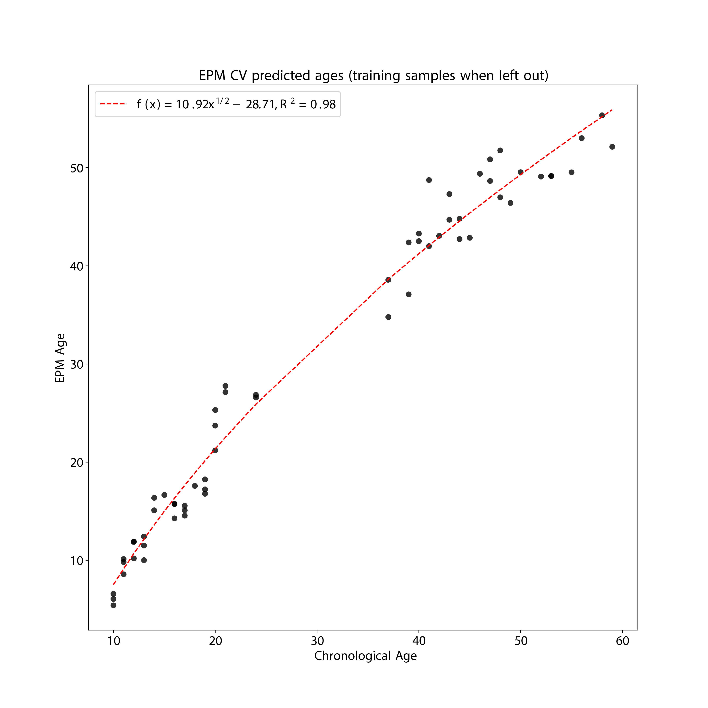

EPM
=========

Description
------------

1. EPM is a modeling tool, not a epigenetic clock. It can be used to model any phenotypes 
   including aging.
2. In contrast to regression bases methods, the EPM does not assume a linear relationship 
   between the epigenetic state and a trait of interest.
3. In contrast to other clocks within this package, the EPM algorithm does NOT come 
   with pre-selected CpGs and pre-calculated coefficients. Instead, users are required
   to provide training data to build the model. In essence, EPM performs CpG selection,
   model fitting, and prediction simultaneously. For more technical details, refer 
   to the `EPM toturial <https://epigeneticpacemaker.readthedocs.io/en/latest/epm_tutorial/>`_.
4. The ``epical EPM`` command need two input files: the first being the beta value spreadsheet, 
   and the second being the meta-information file that specifies the training and test samples 
   (see the example below).

.. csv-table::
   :widths: 25, 55

   "Predictor CpGs", "Subject to training data"
   "Unit", "Subject to training data"
   "Target Tissue", "Subject to training data"
   "Target Population", "Subject to training data"
   "Method", "Fast conditional expectation maximization"
   "Reference", "`Farrell C, et al, Bioinformatics. (2020). <https://pubmed.ncbi.nlm.nih.gov/32573701/>`_"
   "Alias", "EpigeneticPacemaker (EPM)"

Usage
-----
.. code-block:: text

 usage: epical EPM [-h] [-o out_prefix] [-p PCC] [-n NITER] [-k KFOLD]
                   [-e ETOL] [-d DELIMITER] [-f {pdf,png}] [-l log_file]
                   [-i {-1,0,1,2,3,4,5,6,7,8,9,10}] [-r ref_file] [--debug]
                   Input_file meta_file

 positional arguments:
   Input_file            The input tabular structure file containing DNA
                         methylation data. This filemust have a header row,
                         which contains the names or labels for samples
                         Thefirst column of this file should contain CpG IDs.
                         The remaining cells in thefile should contain DNA
                         methylation beta values, represented as floating-
                         pointnumbers between 0 and 1. Use a TAB, comma, or any
                         other delimiter to separatethe columns. Use 'NaN' or
                         'NA' to represent missing values. This file can be a
                         regular text file or compressed file (".gz", ".Z",
                         ".z", ".bz", ".bz2", ".bzip2").
   meta_file             This file contains the meta information for each
                         sample. This file must have a header row, which
                         contains the names or labels for variables. The 'Age'
                         variable must exist. The 'Designation' variable is
                         used to designate training and testing samples.

 options:
   -h, --help            show this help message and exit
   -o out_prefix, --output out_prefix
                         The PREFIX of output files. If no PREFIX is provided,
                         the default prefix "EPM_out" is used. The generated
                         output files include: "<PREFIX>.test_EPM_age.tsv": The
                         predicted EPM age for testing samples.
                         "<PREFIX>.train_EPM_age.tsv": The predicted EPM age
                         for training samples. "<PREFIX>.test_EPM_age.pdf" or
                         "<PREFIX>.test_EPM_age.png: Scatter plot showing the
                         trend between the predicted EPM ages and chronological
                         ages for testing samples. "<PREFIX>.train_EPM_age.pdf"
                         or "<PREFIX>.train_EPM_age.png: Scatter plot showing
                         the trend between the predicted EPM ages and
                         chronological ages for training samples.
                         "<PREFIX>.test_selected_CpGs.tsv": Selected feature
                         CpGs and their beta values for testing samples.
                         "<PREFIX>.train_selected_CpGs.tsv": Selected feature
                         CpGs and their beta values for training samples.
   -p PCC, --pcc PCC     Threshold of absolute Pearson correlation coefficient
                         between chronological age and beta values. This cutoff
                         is used to select age-associated CpG sites.
   -n NITER, --niter NITER
                         Iteration times of expectation–maximization.
   -k KFOLD, --kfold KFOLD
                         Folds for cross-valiation.
   -e ETOL, --etol ETOL  Error tolerance during model fitting. The acceptable
                         level of deviation between the EPM predicted age and
                         the chronological age.
   -d DELIMITER, --delimiter DELIMITER
                         Separator (usually TAB or comma) used in the input
                         file. If the separator is not provided, the program
                         will automatically detect the separator.
   -f {pdf,png}, --format {pdf,png}
                         Figure format of the output coef plot. It must be
                         "pdf" or "png". The default is "pdf".
   -l log_file, --log log_file
                         This file is used to save the log information. By
                         default, if no file is specified (None), the log
                         information will be printed to the screen.
   -i {-1,0,1,2,3,4,5,6,7,8,9,10}, --impute {-1,0,1,2,3,4,5,6,7,8,9,10}
                         The imputation method code must be one of the 12
                         digits including (-1, 0, 1, 2, 3, 4, 5, 6, 7, 8, 9,
                         10). The interpretations are: -1: Remove CpGs with any
                         missing values. 0: Fill all missing values with '0.0'.
                         1: Fill all missing values with '1.0'. 2: Fill the
                         missing values with **column mean** 3: Fill the
                         missing values with **column median** 4: Fill the
                         missing values with **column min** 5: Fill the missing
                         values with **column max** 6: Fill the missing values
                         with **row mean** 7: Fill the missing values with
                         **row median** 8: Fill the missing values with **row
                         min** 9: Fill the missing values with **row max** 10:
                         Fill the missing values with **external reference** If
                         10 is specified, an external reference file must be
                         provided.
   -r ref_file, --ref ref_file
                         The external reference file contains two columns,
                         separated by either tabs or commas. The first column
                         represents the probe ID, while the second column
                         contains the corresponding beta values.
   --debug               If set, print detailed information for debugging.

Example
---------

Prepare the meta-information file. In this instance, the 80 samples were shuffled, 
and subsequently, 60 (75%) samples were chosen as "training" samples, while the 
remaining 20 (25%) samples were designated as "testing" samples.

.. Note::
   The meta-information file must have two columns named as "Age" and "Designation".

``$ cat Test2_blood_N80_450K_info2.tsv``

.. code-block:: text

 ID  Sex Age Designation
 I304 F 37  train
 I080 M 12  train
 I513 M 41  train
 I118 M 10  train
 I063 F 13  train
 I550 M 19  train
 I097 M 44  train
 I282 M 50  train
 I257 M 48  train
 I015 M 24  train
 I302 F 43  train
 I290 M 14  train
 I224 F 37  train
 I057 F 44  train
 I255 F 17  train
 I572 F 41  train
 I028 F 13  train
 I215 F 16  train
 I007 M 20  train
 I537 F 21  train
 I060 F 20  train
 I481 F 56  train
 I037 M 20  train
 I251 F 48  train
 I163 F 11  train
 I589 M 59  train
 I109 M 49  train
 I006 M 53  train
 I167 M 53  train
 I004 F 11  train
 I148 M 52  train
 I482 F 24  train
 I270 F 17  train
 I074 F 12  train
 I159 M 40  train
 I478 M 39  train
 I286 F 17  train
 I127 F 15  train
 I072 M 12  train
 I035 F 19  train
 I228 F 55  train
 I020 M 11  train
 I292 F 14  train
 I114 M 47  train
 I229 M 21  train
 I349 M 43  train
 I173 F 47  train
 I032 M 13  train
 I013 M 10  train
 I495 M 46  train
 I107 M 18  train
 I213 F 16  train
 I190 F 45  train
 I058 M 19  train
 I104 F 10  train
 I211 M 16  train
 I135 M 39  train
 I091 F 40  train
 I311 F 58  train
 I152 F 42  train
 I280 F 14  test
 I182 M 51  test
 I092 M 15  test
 I391 F 52  test
 I458 M 54  test
 I279 M 55  test
 I066 M 15  test
 I077 F 42  test
 I234 F 51  test
 I024 F 49  test
 I603 F 18  test
 I379 M 57  test
 I418 F 46  test
 I268 M 38  test
 I338 M 18  test
 I034 F 38  test
 I230 F 50  test
 I412 M 60  test
 I188 M 45  test
 I274 F 54  test

``$ epical Cortical Test4_brain_N16_EPICv2_beta.tsv.gz -m Test4_brain_N16_EPICv2_info.tsv -o Cortical``

.. code-block:: text

 2024-01-23 07:26:09 [INFO]  The prefix of output files is set to "EPM".
 2024-01-23 07:26:09 [INFO]  Read input beta file: "Test2_blood_N80_450K_beta.tsv.gz"
 2024-01-23 07:26:39 [INFO]  Fill missing values with ZEROs ...
 2024-01-23 07:26:39 [INFO]  Input file: "Test2_blood_N80_450K_beta.tsv.gz", Number of CpGs: 478313, Number of samples: 80
 2024-01-23 07:26:39 [INFO]  Read meta information file: "Test2_blood_N80_450K_info2.tsv"
 2024-01-23 07:26:39 [INFO]  Split samples into training and testing sets ...
 2024-01-23 07:26:39 [INFO]  60 samples are included in training set: I304, I080, I513, I118, I063 ...
 2024-01-23 07:26:39 [INFO]  20 samples are included in testing set: I280, I182, I092, I391, I458 ...
 2024-01-23 07:26:39 [INFO]  Calculate pearson correlation coefficients ...
 2024-01-23 07:26:40 [INFO]  100 CpG sites are selected: cg00103778, cg00303541, cg00329615, cg00439658, cg00462994 ...
 2024-01-23 07:26:40 [INFO]  Save beta values of selected CpGs to "EPM.train_selected_CpGs.tsv"
 2024-01-23 07:26:40 [INFO]  Save beta values of selected CpGs to "EPM.test_selected_CpGs.tsv"
 2024-01-23 07:26:40 [INFO]  Initialize the EPM model ...
 2024-01-23 07:26:40 [INFO]  Fit the EPM model using training data ...
 2024-01-23 07:26:40 [INFO]  Get training sample EPM predictions (when left out) ...
 2024-01-23 07:26:40 [INFO]  Save predicted EPM ages of traning samples to "EPM.train_EPM_age.tsv"
 2024-01-23 07:26:40 [INFO]  Predict testing samples ...
 2024-01-23 07:26:40 [INFO]  Save predicted EPM age of testing samples to "EPM.test_EPM_age.tsv"
 2024-01-23 07:26:40 [INFO]  Generate scatter plot of test samples and save to "EPM.test_EPM_age.pdf"

Ouput
------

A total of six files were generated.

.. glossary::

   1. EPM.train_selected_CpGs.tsv
     Selected predictor CpGs and their beta values from training samples. 
   
   2. EPM.train_EPM_age.tsv
     Predicted age for training samples. Please note, the "cross validated version of the EPM" is
     implemented here, so **prediction is made for each sample when the sample is left out of model fitting**.
   
   3. EPM.train_EPM_age.pdf
     Scatter plot showing the concordance betweent "Chronological age" and "predicted age" (for training samples).
   
   4. EPM.test_selected_CpGs.tsv
     Selected predictor CpGs and their beta values from testing samples. 
   
   5. EPM.test_EPM_age.tsv
     Predicted age for testing samples.

   6. EPM.test_EPM_age.pdf
     Scatter plot showing the concordance betweent "Chronological age" and "predicted age" (for testing samples).

EPM_train.png

EPM_test.png

